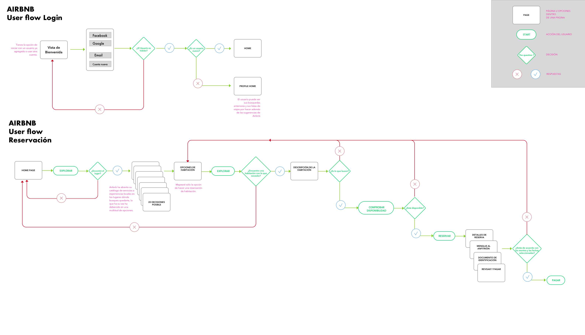

# User Flow

Airbnb es una app que ha revolucionado el modo en que viajamos, pues ha creado un puente entre los particulares, tanto los que tienen un espacio libre que rentar, como los que buscan un lugar barato y cómodo dónde pasar su estadía fuera de casa, y aunque esta es la base del servicio de la app, también ha crecido de a cuerdo a cómo sus usuarios utilizan el servicio, entonces ahora también tiene espacio para hoteles, anfitriones profesionales, restaurantes, museos o show que brinden experiencias, toda una agencia de viajes de bolsillo.

----

### Mapeando Airbnb

La app es muy compleja y extensa en su versión actual, por lo que para este ejercicio me enfocaré únicamente en dos acciones:

* Login
* Reservación de habitación.

### Login

**Airbnb** es una app que está todo el tiempo activa, por lo que para empezar el mapeo tuve que cerrar la sesión actual de la app, acción que fue muy difícil de realizar, me llevó más de 10 minutos dar con el botón de cerrar sesión, que por un momento pensé que no contaba con esta opción.

Ya que pude salir, en la pantalla de *Bienvenida* **Airbnb** tiene la opción de guardar tu usuario, o si gustas iniciar con un usuario nuevo; al ingresar con una cuenta nueva puedes vincular tu cuenta con tu usuario de Facebook o Google, ingresar con tu mail si ya tienes una cuenta anterior, o crear una cuenta nueva.

### Reservación

Reservar en **Airbnb** se ha vuelto fácil pero más largo que hace unos años, y esto se intuye que ha ocurrido por motivos de seguridad, cada vez es más importante verificar que tanto los anfitriones como los invitados sean usuarios reales, además de que como anfitrión también te pide que compruebes que el inmueble existe, esto y la opción de dejar reseñas ha creado un servicio en mejoras continuas ya que Airbnb celebra como superhost a los anfitriones que tienen más reservaciones y mejor puntaje colocando tus habitaciones en los primeros lugares de las búsquedas.

Las opciones de pago también son muy amigables, teniendo a paypal, tarjeta de débito o crédito. Es posible facturar pero únicamente por el porcentaje que Airbnb le cobra a los anfitriones, o sea, el 3% de tu costo total.

### Conclusiones

La interfaz en general me parece muy sencilla además de que es notorio que **Airbnb** itera constantemente los datos que le proporciona la app, y ha adaptado los servicios acorde a cómo utilizan la aplicación, ejemplo:
> Tú persona particular puedes rentar un departamento mientras estás de viaje, para ganar algo de dinero en el lapso que no ocupas ese espacio. Pasa el tiempo y personas empiezan a rentar sus departamentos vacíos o casas de campo familiares, pasa el tiempo y personas se dedican profesionalmente a rentar los inmuebles de otras personas... Airbnb lo nota y crea el perfil de host profesional, ahora los host profesionales pueden ofrecer directamente sus servicios a personas que no quieran o no puedan administrar sus inmuebles.

Por la cantidad de opciones y flujos que contiene la aplicación entiendo perfectamente que necesita equipos de desarrolladores y user experience experts para cada acción o flujo a realizar, me imagino que ha de haber un equipo para búsquedas, otro para experiencias, otro para reservaciones, etc.
